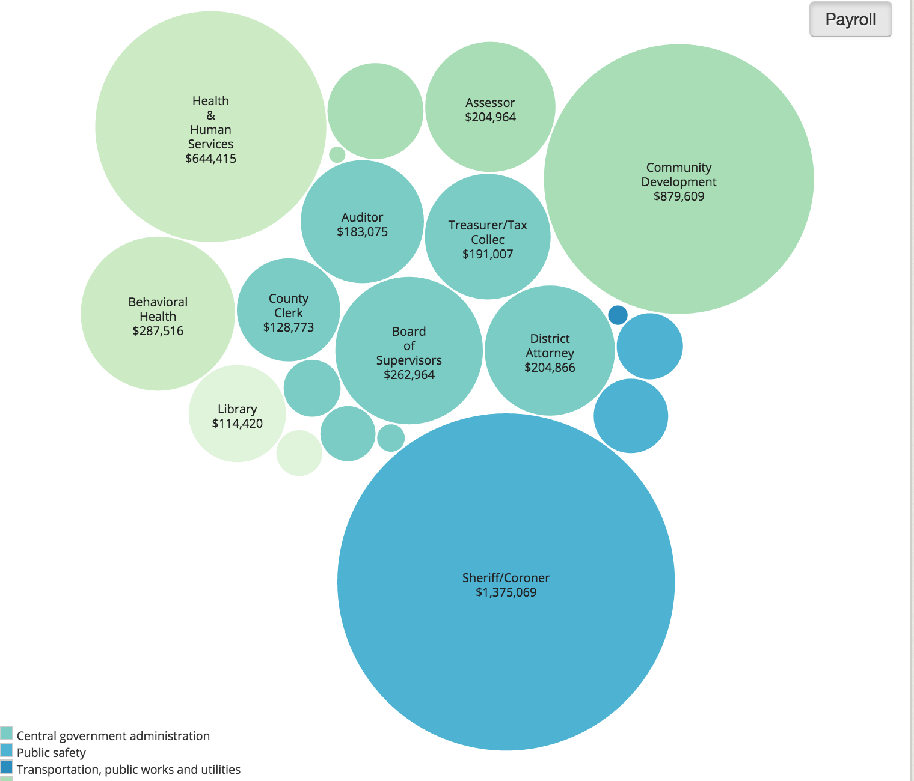
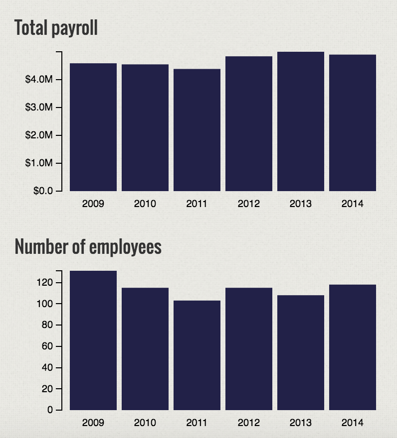

# Concept and documentation

## App name: [Pay Day California](http://payday.cironline.org/)

## Elevator pitch

California is one of the biggest states in the country with thousands of public employees. Why not have a website that keeps track of the salaries of government employees? This will not only help highlight places where the government is bleeding money and help keep it accountable, but will also bring in more transparency for the employees themselves -- in terms of gender pay disparity.

It is also a very easy way for people to see where their tax dollars are being spent by the state

## Inspirations and Prior Work

- [Texas Tribune Government Salary Explorer](https://salaries.texastribune.org/)
  + Texas Tribune has a well-designed site with a similar functionality.
  + Though they have a listing by agency, I believe I can provide a county-wise selection. People often care about what is happening around them and letting them navigate to their local community officials is a useful way of drawing them in
- [Transparent California](http://transparentcalifornia.com/)
  + This is the first search result if you Google "California public salary". It is technically not a news app and the navigation leaves much to be desired
  + There is not much to attract people to explore the site.
- [State Worker Salary Database](http://www.sacbee.com/site-services/databases/state-pay/article2642161.html)
  + Sacramento Bee has its own version of a database. It has a clean, simple design. 
  + But again, it provides an agency-based navigation. Many people don't really know which agency to look for, so I reiterate that a location-based navigation will help attract more users
- [Government Composition California](http://publicpay.ca.gov/)
  + This is the original government website. This does provide a county-based navigation
  + This packs in too much information and it is hard for people to follow

# Data

## Data sources
1. The California government [website](http://publicpay.ca.gov/Reports/RawExport.aspx)
2. The individual websites of each city also has a salary CSV. E.g. [Palo Alto](http://data.cityofpaloalto.org/dataviews/227867/2015-city-of-palo-alto-employee-salaries/)
3. Shapefiles for [California counties](https://catalog.data.gov/dataset/tiger-line-shapefile-2013-state-california-current-place)

## Slimming down the data
I will have to clean up the data and make sure all the agency names are standardized. In terms of size, I don't think it will be too big to cause troubles.

## Joining two datasets
I will show a map of the county chosen by the user. So the joining will be done to the respective shapefile. I imagine I will dynamically generate this map depending on what the user chooses.

# Filtering options

## Attributes to search/find by

- Allow the user to [select city/county](http://payday.cironline.org/)
- Allow the user to type in a city or county name.

# Views and Routes
- There will be one landing view which will ask users to choose a county
- Once the place has been chosen, we will show a [detail/dashboard view](http://payday.cironline.org/county/alpine/). This will basically show users the distribution of pay for the chosen city/county. 
- There will also be a [department view](http://payday.cironline.org/department/38296/?batch_id=308414) from the detail view, where users can choose to see salaries of a department of their choosing.

# Visualizations and charts
1. A bubble chart showing total salaries paid out by major departments. This is to show the vast difference in expenditures across departments and to see who is spending the most money.

2. Bar charts that show total payroll, number of employees, and pay per employee.

## Tables
We will also have a table that shows the employees arranged in descending order of salary. This will be seen in the detail view as well as the department view

# Deployment
I imagine an Amazon EC2 or even a premium Heroku account would be sufficient. This does not require a really huge database.